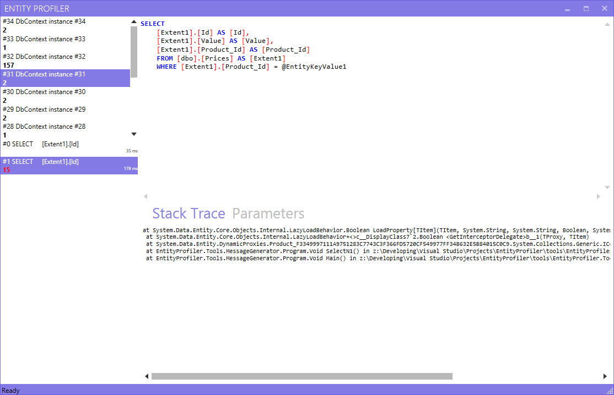

# EntityProfiler

An initiative for creating an open-source Entity Framework profiler. 

## Features
- View syntax highlighted queries.
- Context-aware: Knows about HttpContext when using ASP.NET.
- Duplicate or SELECT 1+N detectiom query detection, shows the number of duplicated queries.

## How to use it
Install the EntityProfiler.Interceptor NuGet package or install manually:

1. Add references to EntityProfiler.Common and EntityProfiler.Interceptor to your project.
2. Register the interceptor in either the `DbConfiguration` or in your web.config file:

        <entityFramework>
           ...
           
           <interceptors>
             <interceptor type="EntityProfiler.Interceptor.Core.ProfilingInterceptor, EntityProfiler.Interceptor"/>
           </interceptors>
        </entityFramework>
        
3. Run the EntityProfiler.UI application which will automatically connect.

## Current limitations
Only one profiling application instance is allowed. Currently the interceptor opens a TCP socket on a fixed port on localhost and no configuration is yet possible.

## Contributions
This project accepts contributions. Please put an issue in the issue track first to prevent confusion.
